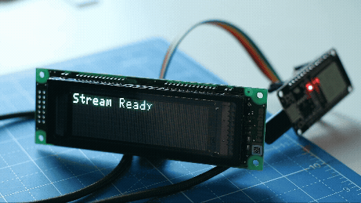

# FutabaNAGP1250 Streaming Demo



This is a companion project for the [FutabaNAGP1250_Arduino](https://github.com/pleoni/FutabaNAGP1250_Arduino) library. It demonstrates high-performance video streaming to the Futaba VFD using a compressed binary protocol.

## Features

-   **High Frame Rate**: Streams video/camera at ~30 FPS.
-   **Compression**: Uses PackBits (RLE) delta compression to minimize serial bandwidth.
-   **Robustness**: Uses COBS framing, CRC32 checksums, and flow control (ACKs).
-   **Dithering**: Advanced dithering algorithms (Sierra, Floyd-Steinberg, Bayer) via FFmpeg.
-   **Dual Mode**: Supports both Camera streaming and Video File playback.
-   **Orientation Support**: Automatically handles 140x32 (Horizontal) and 32x140 (Vertical) orientations.

## Prerequisites

-   **Node.js**: v16+
-   **FFmpeg**: Must be installed and in your system PATH (`brew install ffmpeg`).
-   **PlatformIO** (VSCode Extension) or Arduino IDE.

## Installation

1.  **Firmware**:
    -   Open this folder in VSCode with the PlatformIO extension.
    -   Connect your ESP32.
    -   Upload the firmware: `pio run -t upload`
    -   (Or check `platformio.ini` for library deps if using Arduino IDE).

2.  **Node.js Client**:
    -   Install dependencies:
        ```bash
        npm install
        ```

## Usage

### 1. Stream from Camera
By default, the script streams from the default camera input.

```bash
node stream.js
```

### 2. Stream from File
To stream a video file (looping):

```bash
VIDEO=myvideo.mp4 node stream.js
```

### 3. Configuration via Environment Variables

You can tweak the stream using environment variables:

| Variable | Default | Description |
| :--- | :--- | :--- |
| `SERIAL_PORT` | `/dev/cu.usbserial-0001` | Serial port path. |
| `SERIAL_BAUD` | `230400` | Baud rate (must match firmware). |
| `MODE` | `sierra2_4a` | Dithering mode (`none`, `bayer`, `floyd_steinberg`, `sierra2`, `sierra2_4a`, `heckbert`). |
| `COMPRESSION` | `true` | Enable/Disable RLE compression (`true`/`false`). |
| `CONTRAST` | *varies* | Contrast adjustment (e.g., `1.2`). |
| `BRIGHTNESS` | *varies* | Brightness adjustment (e.g., `0.1`). |
| `ORIENTATION` | *auto* | `horizontal` (140x32) or `vertical` (32x140). Auto-detects based on source. |
| `TRANSPOSE` | `0` | FFmpeg transpose mode for horizontal orientation (0=CCW+VFlip). |
| `START_TIME` | `00:00:00` | Start time for video files (HH:MM:SS). |

**Example:**
```bash
MODE=bayer CONTRAST=1.5 COMPRESSION=1 VIDEO=movie.mp4 node stream.js
```

## Protocol Details

The project uses a FlatBuffers schema (`frame.fbs`) to define the wire protocol.
-   **Full Frame**: Complete bitmap.
-   **Delta Frame**: XOR difference compressed with PackBits.

To regenerate the protocol code if you edit `frame.fbs`:
```bash
flatc --cpp -o include/ frame.fbs
flatc --ts -o futaba/ frame.fbs
```
